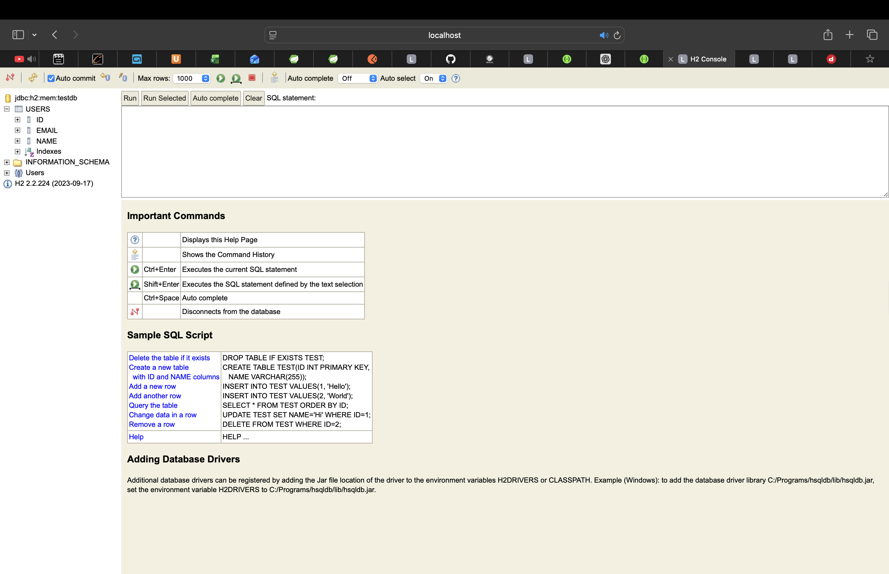
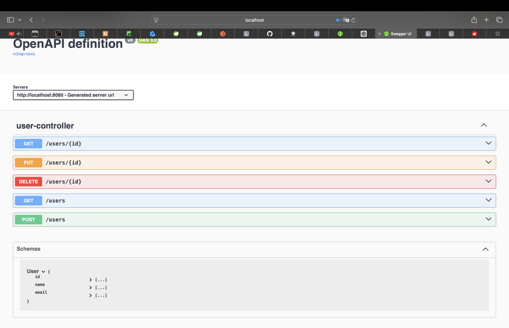
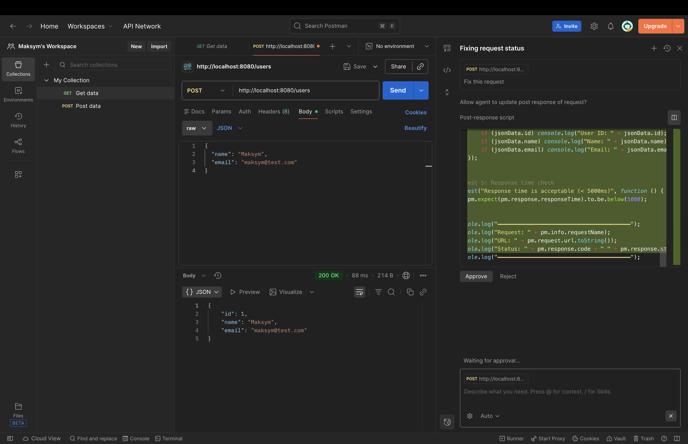
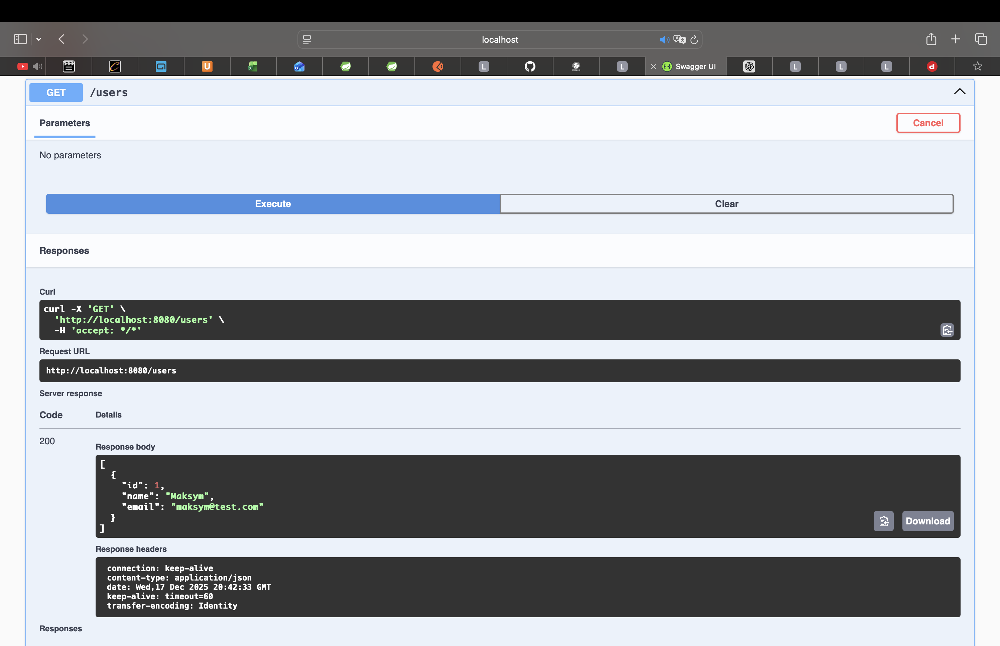
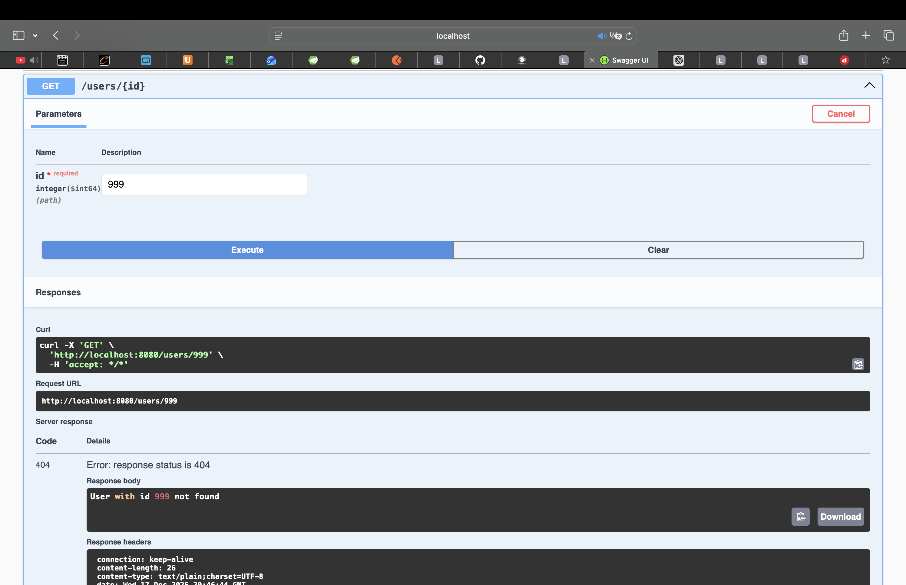

 Task 2 — REST API with Spring Boot

 Project Description
This project is a simple REST API built with Spring Boot.
It demonstrates basic CRUD operations using REST principles
The application uses an in-memory H2 database and is tested using Postman and Swagger UI.

Technologies Used
- Java 17
- Spring Boot
- Spring Web (REST)
- Spring Data JPA
- H2 Database
- Swagger (OpenAPI)
- Maven

 Use Case Description

The system allows managing users via a REST API

A user of the system can:
- create a new user
- retrieve all users
- retrieve a user by ID
- update a user
- delete a user

If a user with a specific ID does not exist, the system returns an error message.
All API endpoints can be tested using Postman and Swagger UI.

 API Endpoints

| Method | Endpoint      | Description            |
|------|-----------------|------------------------|
| POST | /users          | Create a new user      |
| GET  | /users          | Get all users          |
| GET  | /users/{id}     | Get user by ID         |
| PUT  | /users/{id}     | Update user by ID      |
| DELETE | /users/{id}   | Delete user by ID      |

Database
The application uses an H2 in-memory database
The database is created automatically when the application starts.

H2 Console:
http://localhost:8080/h2-console

 Swagger is available at:
http://localhost:8080/swagger-ui/index.html

Screenshot

The client sends a POST request to create a new user

Result:
A new user is saved in the database and returned as JSON

The client requests a list of all users stored in the database

Result:
A JSON list of users is returned

The client requests a single user by ID

Result:
User data is returned as JSON if the user exists

The client deletes a user by ID

Result:
User is removed from the database

The client requests a user that does not exist

Result:
The application returns HTTP 404 with an error message

The API was tested using:
- Postman
- Swagger UI

All CRUD operations work as expected

 Conclusion
This project demonstrates a basic REST API using Spring Boot
It includes CRUD operations, database integration, exception handling, and API documentation using Swagger.
